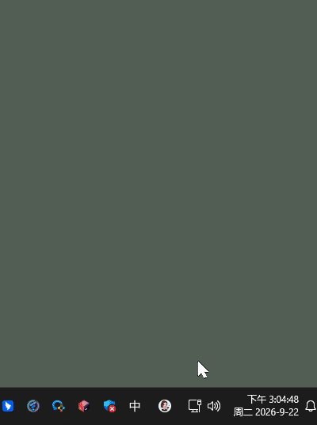
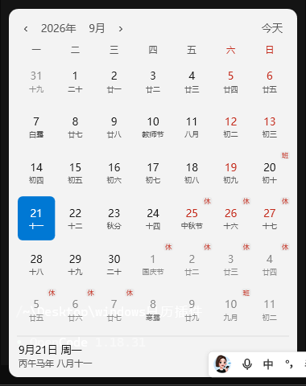
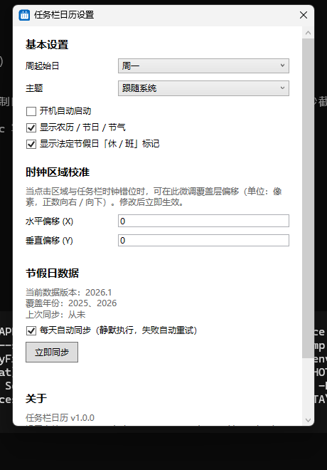

# 任务栏日历（Taskbar Calendar）

点击 Windows 11 任务栏右下角时钟，弹出**自己的日历** —— 替代系统原生日历弹窗。

**官网（国内可直连下载）：<https://calendar.icewang.qzz.io/>**

> 原生时钟显示不受影响；点击铃铛的通知中心也照常可用。



## 功能特性

- **点击替换**：点击任务栏时钟弹出本日历，不再弹出系统原生日历面板
- **月历视图**：农历日期、二十四节气、传统节日（春节 / 端午 / 中秋等）、公历节日
- **休班标记**：法定节假日「休」、调休上班「班」一目了然
- **数据自动更新**：每天静默同步节假日数据（含调休安排），也可以在设置中「立即同步」
- **年 / 月选择器**：点击标题快速跳转任意年月；支持滚轮翻月与键盘导航
- **主题跟随**：深浅色自动跟随系统，也可手动指定
- **实用功能**：托盘图标、开机自启、右键时钟快捷菜单、周起始日切换（周一 / 周日）、点击区域校准
- **轻量**：内存占用低，空闲时不消耗 CPU





## 下载安装

**方式一（推荐，国内直连）**：打开官网 <https://calendar.icewang.qzz.io/>，点击「立即下载」。

**方式二（GitHub）**：

1. 前往 [Releases](https://github.com/IceCoder1994/taskbar-calendar/releases) 页面
2. 下载最新版 `TaskbarCalendar-vX.X.X-lite-win-x64.zip`（约 140 KB）
3. 解压到任意文件夹（如 `D:\TaskbarCalendar`）
4. 双击 `TaskbarCalendar.exe` 运行 —— 程序会驻留在系统托盘（蓝色日历图标）
5. 点击右下角时钟，即可看到你的日历

**系统要求**：Windows 11（64 位）+ [.NET 8 桌面运行时](https://dotnet.microsoft.com/download/dotnet/8.0)

> **没有安装 .NET 运行时？** 不用手动找：双击程序后 Windows 会弹出官方提示，
> 点击「是」自动跳转微软下载页安装（约 55MB，一次性，装完后所有 .NET 程序通用）。

> **首次运行提示**：由于程序未做数字签名，Windows SmartScreen 可能提示「Windows 已保护你的电脑」。
> 请点击「更多信息」→「仍要运行」。如杀毒软件误报，请将程序目录添加为信任。

## 使用说明

| 操作 | 效果 |
| --- | --- |
| 左键点击时钟 | 弹出 / 收起日历面板 |
| 右键点击时钟 | 快捷菜单（打开日历 / 设置 / 退出） |
| 双击托盘图标 | 打开日历 |
| 托盘右键菜单 | 设置、开机自启、重新定位时钟、日志、关于 |
| Esc / 点击面板外 | 关闭日历面板 |
| 滚轮 / PgUp / PgDn | 翻月 |
| 方向键 | 移动选中日期 |

## 常见问题

**Q：点击时钟没反应，或点击区域与时钟错位？**
A：打开托盘菜单 → 设置 → 「时钟区域校准」，微调水平 / 垂直偏移；也可以点「重新定位时钟」强制刷新。

**Q：通知中心去哪了？**
A：通知中心不受影响：点击时钟右侧的铃铛图标，或按 `Win + N` 打开。本程序只接管「点击时钟弹日历」这一个行为。

**Q：法定节假日数据会过期吗？**
A：不会。程序每天自动同步一次节假日数据（静默执行、失败自动重试）；也可以在 设置 → 节假日数据 中点击「立即同步」。

**Q：如何卸载？**
A：托盘右键 → 退出，然后删除程序文件夹即可。如果开启过开机自启，请在设置中关闭，或删除注册表项 `HKCU\Software\Microsoft\Windows\CurrentVersion\Run\TaskbarCalendar`。

## 数据来源

- 农历 / 节气 / 传统节日：基于 .NET 内置农历算法计算
- 法定节假日与调休：依据国务院办公厅公告，通过 [timor.tech](https://timor.tech/api/holiday) 接口自动同步

## 开发构建

需要 [.NET 8 SDK](https://dotnet.microsoft.com/download/dotnet/8.0)：

```powershell
git clone https://github.com/IceCoder1994/taskbar-calendar.git
cd taskbar-calendar
dotnet build TaskbarCalendar.sln                              # 构建
dotnet run --project src\TaskbarCalendar                      # 调试运行
powershell -ExecutionPolicy Bypass -File tools\publish.ps1    # 发布轻量版
```

也可以运行 `TaskbarCalendar.exe --settings` 直接打开设置窗口。

官网源码位于 `site/`（纯静态单页，由 Cloudflare Pages 托管，构建输出目录填 `site`）；
发版前执行 `powershell -ExecutionPolicy Bypass -File tools\sync-site.ps1` 可自动同步站点下载包与页面版本号。

## 贡献

欢迎提交 Issue 与 Pull Request！协作流程（Fork + PR）见 [CONTRIBUTING.md](CONTRIBUTING.md)。

## 许可证

[MIT](LICENSE)
